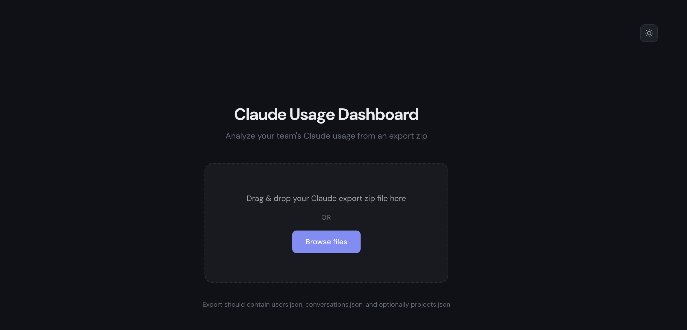
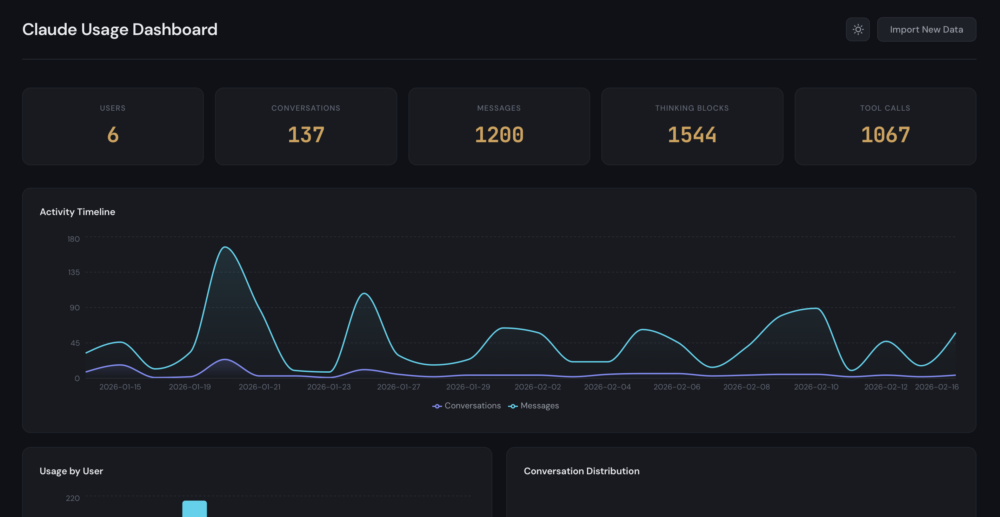

# Claude Usage Dashboard

A client-side web app that visualizes your Claude.ai usage analytics from a data export zip file.

### Import your data


### Explore your usage


## Features

- **Drag-and-drop zip upload** -- accepts the Claude.ai data export format (users.json, conversations.json, optionally projects.json)
- **Summary cards** -- users, conversations, messages, thinking blocks, and tool calls at a glance
- **Activity Timeline** -- area chart showing conversations and messages over time
- **Usage by User** -- bar chart comparing conversation and message counts per user
- **Conversation Distribution** -- pie chart of conversation share per user
- **Tool Usage Breakdown** -- horizontal bar chart of tool calls (artifacts, web_search, etc.)
- **Thinking vs Direct Responses** -- donut chart showing extended thinking adoption
- **Avg Message Length** -- bar chart comparing average prompt and response lengths per user
- **Response Ratio** -- assistant-to-human character ratio per user
- **Projects** -- cards for each project with description, creator, and document count
- **Conversation Topics** -- clickable list with badges for thinking and tool usage
- **Conversation Detail View** -- full message thread with per-conversation stats and tool tags
- **User Details Table** -- tabular breakdown of all per-user metrics
- **Dark / Light theme** -- toggle with localStorage persistence; defaults to system preference

## Tech Stack

- React 19
- TypeScript 5.9
- Vite 7
- Recharts 3 (all charts)
- JSZip (client-side zip parsing)
- DM Sans (body text) / JetBrains Mono (numbers)

## Getting Started

### Prerequisites

- Node 18+ (or Bun)

### Install dependencies

```bash
npm install
# or
bun install
```

### Development server

```bash
npm run dev
# or
bun dev
```

Open [http://localhost:5173](http://localhost:5173) in your browser.

### Production build

```bash
npm run build
# or
bun run build
```

The output goes to `dist/`. You can preview it locally with:

```bash
npm run preview
```

### Lint

```bash
npm run lint
```

## How to Use

1. Go to [claude.ai](https://claude.ai) and export your data (Settings > Account > Export Data). You will receive a zip file by email.
2. Open the dashboard in your browser.
3. Drag and drop the zip file onto the upload area, or click "Browse files" to select it.
4. Explore the charts, click on conversations to see full message threads, and toggle between dark and light themes.

All processing happens entirely in the browser. No data is sent to any server.

## Data Format

The zip file must contain at least two JSON files. A third is optional.

### users.json (required)

```json
[
  {
    "uuid": "string",
    "full_name": "string",
    "email_address": "string",
    "verified_phone_number": "string"
  }
]
```

### conversations.json (required)

```json
[
  {
    "uuid": "string",
    "name": "string",
    "summary": "string",
    "created_at": "ISO 8601 timestamp",
    "updated_at": "ISO 8601 timestamp",
    "account": {
      "uuid": "string (references a user UUID)"
    },
    "chat_messages": [
      {
        "uuid": "string",
        "text": "string",
        "sender": "human | assistant",
        "created_at": "ISO 8601 timestamp",
        "updated_at": "ISO 8601 timestamp",
        "content": [
          {
            "type": "text | thinking | tool_use | tool_result | token_budget",
            "text": "string (optional)",
            "name": "string (tool name, for tool_use type)"
          }
        ]
      }
    ]
  }
]
```

### projects.json (optional)

```json
[
  {
    "uuid": "string",
    "name": "string",
    "description": "string",
    "is_private": false,
    "is_starter_project": false,
    "created_at": "ISO 8601 timestamp",
    "updated_at": "ISO 8601 timestamp",
    "creator": {
      "uuid": "string",
      "full_name": "string"
    },
    "docs": [
      {
        "uuid": "string",
        "filename": "string",
        "content": "string",
        "created_at": "ISO 8601 timestamp"
      }
    ]
  }
]
```

## License

MIT
